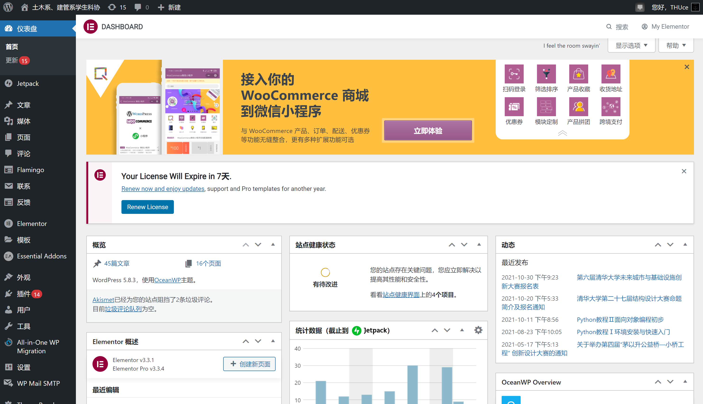

# 网站仪表盘简介

?> 本篇文档介绍网站后台（仪表盘）的功能分区及其主要作用，各个功能的详细用法请参考相应文档。本文中以管理员权限账号仪表盘为例讲解，低于管理员权限账号部分功能可能不可见，需要详细信息可参考[站点角色](character)部分或[咨询技术服务部副主席](mailto:shihz19@mails.tsinghua.edu.cn)。

## 概览

一个典型的管理员权限账号仪表盘如图，我们一般在左侧黑色部分（`侧边栏`）切换各功能，在中间白色部分完成主要工作。

## 各选项卡简介

+ 仪表盘

  + 首页：网站整体情况概览，数据统计等
  + 更新：显示可用的 WordPress、插件、主题更新情况
+ Jetpack：详细的站点统计数据、反垃圾评论集成
+ 文章：管理网站文章、分类、标签
+ 媒体：管理网站中的图片及其它各类文件
+ 页面：管理网站页面
+ 评论：管理网站评论
+ Flamingo：与 Contact Form 7 插件配套的消息存储插件，由于本站目前采用 Forminator 处理表单，保留此插件主要起防止没处理好的 Contact Form 7 遗留表单产生 BUG 的作用（`待废弃`）
+ 联系：Contact Form 7 插件内容管理页面（`待废弃`）
+ 反馈：用途不明，且似乎没有用途
+ Elementor：Elementor插件的全局设置、内置表单管理（`待废弃`）、自定义字体图标代码、Elementor 插件权限管理、维护工具及信息、许可证等
+ Essential Addons：一个 Elementor 拓展插件的管理页面
+ 主题：网站主题、小工具、页眉页脚等部分，简单来说当你发现你要编辑的页面元素 Elementor 改不了的话就来这里找找
+ 插件：管理网站插件
+ 用户：管理网站用户，各类用户权限可参考[站点角色](/character)
+ 工具：一些不迁移服务器通常用不上的网站工具
+ 设置：站点设置
  + 常规：网站标题、管理员地址
  + 撰写：发布文章相关设置
  + 阅读：网站显示相关设置，通常被其余插件 cover 掉了所以不太需要动
  + 讨论：评论相关设置，由于网站事实上不允许评论存在所以不用管
  + 媒体：上传图片尺寸设定
  + 固定连接：伪静态设置，需要配合 [nginx 相关设置](待补充)使用
  + 隐私：关于隐私政策说明页面的设置
  + Gravatar 头像：由于 Gravatar 源服务器被墙，可在此设置 Gravatar 镜像服务器接管头像服务
  + WP-China-Yes：WP-China-Yes 插件设置，主要是 WordPress 本土化相关设定
  + 微信分享：本意是让网站在微信分享时可以有更友好的显示的一个插件相关设置，但由于缺乏已认证公众号支持暂时搁置
  + User Domain Whitelist/Blacklist：用户注册可使用的邮箱后缀黑/白名单
  + 分享：一些非常不本土化的分享按钮设置
  + Comment Notifier：评论邮件提示
  + WP Githuber MD：编辑器 Markdown 支持相关设置
+ WP Mail SMTP：网站邮件发送服务相关设置
+ 微慕小程序：网站-小程序链接依赖插件
+ Theme Panel：OceanWP 主题配置页面
+ Like Buttons：一个好像没什么用的网站点赞插件设置
+ SEO Optimized Images：图片 SEO 优化插件设置
+ Forminator：目前主要使用的表单插件仪表盘
+ Custom WP Admin Login Settings：[网站登录页面](https://thuce.top/wp-login.php)自定义

