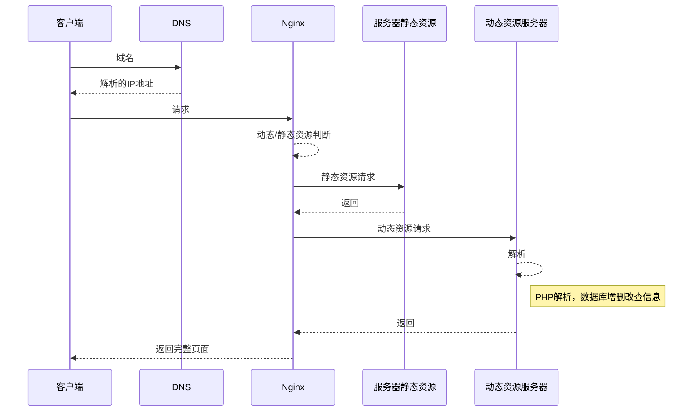

# 网站架构概述
## 服务器

科协网站服务器部署于腾讯云平台，采用 LNMP 架构。即 Linux+Nginx+MySQL+PHP 套件，此部分组件通过宝塔面板安装，无特殊情况同样建议使用宝塔面板进行管理。

CentOS 为网站服务器操作系统，Nginx 为 http 服务器，MySQL 为数据库，PHP 为动态页面使用的脚本语言，客户端访问网站时的处理流程可大致参考下图。通常而言，本网站的日常运维工作不需要对服务器的运行有非常详细的了解，但深入了解这部分知识对进一步的深入维护工作（如新功能的开发、BUG 维修、服务器迁移等）是有益甚至必须的。

## 内容管理系统

内容管理系统（CMS）采用 WordPress，WordPress 主题使用 OceanWP，可视化工具使用 Elementor 插件。WordPress 系统仪表盘是网站日常运维的主要工作区，OceanWP 主题管理网站整体功能区布局，具体文章和页面的排版则由 Elementor 系统可视化控制。熟练掌握 CMS 系统的使用对网站日常运维工作十分重要。

## 版本信息

截止到本篇文档最后一次修改，网站使用的各组件版本号可参考下表。通常而言 LNMP 套件无威胁网站安全的特殊情况不会更新，CMS 系统各组件定于每年寒暑假各进行一次集中更新以获取新特性及维护安全性。

|   组件    |   版本    |
| :-------: | :-------: |
|   Linux   | CentOS7.7 |
|   Nginx   |  1.17.9   |
|   MySQL   |  5.7.29   |
|    PHP    |    7.4    |
| WordPress |   5.8.3   |
|  OceanWP  |   3.0.1   |
| Elementor |   4.8.1   |
