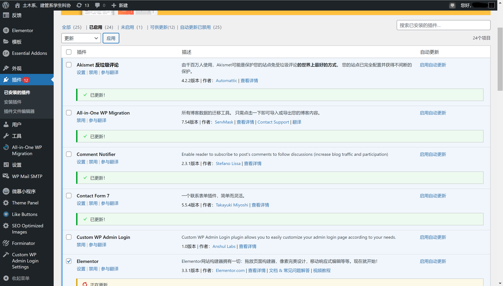
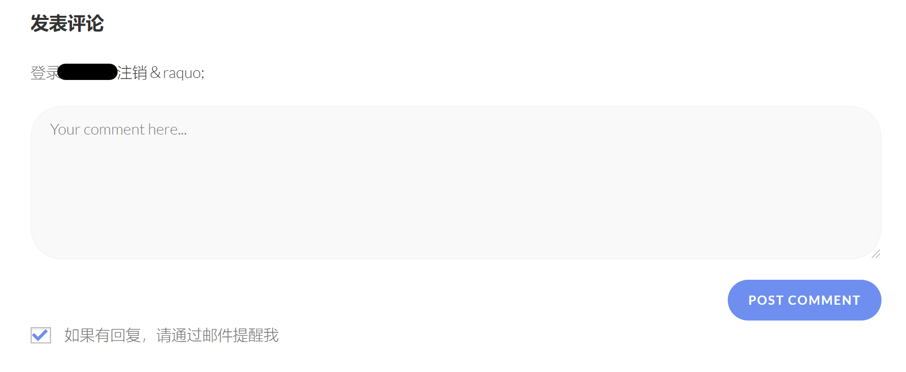

# 站点更新教程

## 流程

站点目前定于每年寒假和暑假两次对 WordPress 主体、OceanWP 主题及全部正在使用的插件进行更新，此处记录 2022-02-06 的更新过程，此后更新流程与此类似。

首先更新 WordPress 主体，使用管理员账号登录仪表盘，在`侧边栏-仪表盘-更新`中蓝色`更新到5.9-zh_CN版本`按钮，等待页面刷新即完成了主体的更新。

!> 此处更新按钮上方会提示在更新前应当备份网站和数据库，由于网站及数据库在宝塔面板中设置过自动备份，因此不必太过在意该提示，如确有需要可在宝塔中手动创建一个备份

接下来更新所有使用中的插件，在`侧边栏-插件`页面中筛选「已启用」插件，全选后选择更新，点击`应用`按钮，可发现插件页面开始逐个更新，等待完成即可。

如有更新失败的插件，可在其余插件更新完成后单独选取该插件再进行一次更新，一般能解决。

最后更新网站主题，在`侧边栏-仪表盘-更新`页面下部勾选 OceanWP 主题并点击`升级主题`，等待页面刷新即可完成。

## 常见问题

1. **更新主题后评论框出现`&raquo;`乱码，效果参考下图？**

   

   此问题属于 OceanWP 主题已知未修的著名 BUG，需要通过魔改源码解决。在仪表盘`侧边栏-外观-主题文件编辑器`页面选择 OceanWP 主题的`comments.php`文件，将代码 41 行左右`Log out`和`&raquo;`之间空格删除，然后更新文件即可。

2. **更新过程中全站卡在「Briefly unavailable for scheduled maintenance. Check back in a minute」页面？**

   一般而言，单个插件/主题更新速度比较快，在更新插件/主题的过程中网站根目录下会放置一个`.maintenance`文件使全站处于问题所述的状态，向访客说明网站正在更新维护，在更新完成后该文件会自动删除。若更新过程中意外中止了更新过程，导致该文件未能正常删除则会导致访问站点任意页面时均卡在「Briefly unavailable for scheduled maintenance. Check back in a minute」页面。出现此问题需要登录宝塔面板，在文件管理中将`.maintenance`文件手动删除，然后重新更新即可。而更新过程意外中止触发条件暂时不明，~~目前已知的情况通常与 GFW 导致的与更新服务器链接不稳有关。~~

   ~~题外话：就是因为自动更新不知道什么时候就会突然触发这个问题我们才决定每年两次在有人看着的时候手动更新的。~~